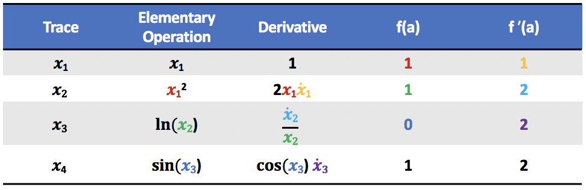

# `pyad`: CS207 Final Project Documentation


## Introduction

Derivatives and derivative arrays (Jacobians, Hessians, etc.) are ubiquitous in science and engineering. Example applications of derivatives include:

- __Data science:__ optimizing the parameters of a predictive model
- __Electrical engineering:__ simulating circuits with semiconductor elements
- __Climatology:__ modeling changes in atmospheric conditions while assimilating data from sensors around the world
- __Finance:__ calculating the price of financial instruments

In these cases (and many others involving simulation or optimization), it's necessary to compute derivatives and preferably not by hand.

So, how can derivatives be implemented in computer software?

One way is to create a numerical approximation (typically  using finite difference methods), however, this approach is prone to truncation error and is accurate only to a limited number of significant digits.

Another way is to use a computer algebra system to symbolically compute the derivative, however, this has a high computational cost.

The method of __Automatic Differentiation__ solves both these issues!

It is able to compute derivatives to machine precision in a fast, efficient way.

## Background

To see how automatic differentiation works, consider the following simple example:


Recall the chain rule, which states that if we have a function h(u(t)),  then


We can differentiate f(x) symbolically using the chain rule:


and evaluate the function and its derivative at, for example, a=1:


The first derivative is rather ugly, and it will keep getting uglier if we take higher order derivatives. Consider the following similar but slighly modified approach:

We can represent f(x) as a graph consisting of a series of computations:


The function is broken down into a sequence of __elementary operations.__ The value of $x_i$ at each step in the sequence is referred to as the __evaluation trace__.

We can create a table of the trace and its derivative at each step in the computation. We "seed" the derivative with a value of 1 and then proceed in steps:



This is conceptually the same thing that we did above when we differentiated symbolically using the chain rule and we find the same solution ___but___ notice that all we need to compute the the values of f(a) and f'(a) for each trace are the values in the row above (represented by corresponding colors in the table), and the differentiation rules for some simple elementary functions. There's no need to represent or store all those intermediate algebraic expressions symbolically. This is the beauty of automatic differentiation!

Although this example is very simple for illustrative purposes, the same idea can be generalized to multivariate and vector-valued functions. The matrix of first-order partial derivatives of a vector-valued function is referred to as the __Jacobian matrix__ of the functon, J<sub>f</sub>(_x_). Rather than creating a direct mapping between an input vector _x_ and full the Jacobian of a given function J<sub>f</sub>(_x_), automatic differentiation evaluates the action of the Jacobian on a vector _u_, computing the __Jacobian-vector product__ J<i>u</i>. When we represent our function of interest, f,  as a composite of N elementary functions, f = f<sub>N</sub>◦f<sub>N-1</sub>...◦f<sub>2</sub>◦f<sub>1</sub>, we can represent the Jacobian as J = J<sub>N</sub>·J<sub>N-1</sub>...·J<sub>2</sub>·J<sub>1</sub> due to the chain rule. We seed _u_ as a unit vector and then recursively compute matrix-vector products:

<p align="center"><i>u</i><sub>1</sub> = J<sub>1</sub><i>u</i></p align="center">
<p align="center"><i>u</i><sub>n</sub> = J<sub>n</sub><i>u</i><sub>n-1</sub> </p align="center">

The unit vector chosen for _u_ detemines which variable we are deriving with respect to. Consequently, we are able to compute only the partial derivatives we need rather than computing the full Jacobian.

This method of automatic differentiation (which is referred to as __forward mode__), can be very efficiently implemented as the previous evaluation trace can be overwritten at each step in the computation. We do not need to store the full sequence of evaluation traces. This is not true of other methods of automatic differentiation, such as the reverse mode.

See the **Extension** section below for more details on the reverse mode.

## How to use `pyad`

### How to Install

pyad is available through PyPi  as pyad207 (https://pypi.org/project/pyad207/1.0.0/) through the command `pip install pyad207`. To ensure correct installation please test using a virtual environment as follows (this example uses conda but feel free to use any venv).
```bash
conda create --name pyad_env
conda activate pyad_env
conda install pip

pip install pyad207

echo 'import pyad' > pyad_test.py

python pyad_test.py
```

This should run without error

Alternatively pyad will be self contained on Github and should be installable using pip and the github ssh address.

pip install git+git://github.com/fire-breathing-rubber-lemons/cs207-FinalProject

**pyad** will follow the standard Python packaging framework. To use the forward and reverse mode modules of **pyad** it will first need to be imported using:

```python
import pyad.forward_mode as fwd
import pyad.reverse_mode as rev
```

### Interaction Theory

In general the **pyad** package will work on an object oriented, class based approach similar to numpy and pytorch. **pyad** will contain a number of classes which can be instantiated. These classes include `Tensor` which is our primary wrapper around numbers and their derivatives, and `Variable` which inherits `Tensor` and represents a variable that should be differentiated against. The forward and reverse mode modules will contain seperate implementations of these classes. The user will create functions to be differentiated and initialize variables. There will not be a specific set of default inputs as each user may have a very different use case (differentiating a single variable or multi-variable function for instance).

The user should be able to specify any differentiable function in the standard format, either a defined python function or a lambda function:

```python
def test_function(x, y):
    cos_x = fwd.cos(x)
    sin_y = fwd.sin(y)
    output = cos_x * sin_y
    return output


lambda x, y: fwd.cos(x) * fwd.sin(y)
```

**pyad** should be able to deal with either of these cases and end up with the same result, hence allowing the user to build functions of arbitrary complexity and not worry about having to change the implementation method.

### Demo of forward mode

```python
import pyad.forward_mode as fwd

x = fwd.Variable('x', 1)
y = fwd.Variable('y', 2)
z = fwd.Variable('z', 3)

>>> x**2 + 2*y + z
Tensor(8, D(z=1, x=2, y=2))

def test_fun(x, y, z):
	return fwd.exp(fwd.cos(x) + fwd.sin(y))**z

>>> result = test_fun(x,y,z)
>>> result.value
77.38548247505909
>>> result.d['x']
-195.35291444436658
>>> result.d['y']
-96.61117118001052
>>> result.d['z']
112.17797471022807
```


### Demo of reverse mode
```python
import pyad.reverse_mode as rev

x = rev.Tensor(0.5)
y = rev.Tensor(4.2)
z = rev.Tensor(3)
f = x * y**3 + rev.sin(x) - rev.logistic(z)

f.backward()

>>> f.value
36.570851411781774
>>> x.grad
74.96558256189039
>>> y.grad
26.46
>>> z.grad
-0.045176659730912144
```

### Demo of graph mode

As an additional helper function to allow users to explore their function trace, pyad contains a graphing class - `rev_graph` which is included in `pyad.reverse_mode`.

This simple additional class can be valuable in helping to understand the flow of elementary functions through the automatic differentation trace. Currently this class only supports the function value graph and not the graph of the derivative but this is something which we're looking to add in the future (see Future section).

This is a demonstration of the code required to plot the reverse mode graph and the example output:
```python
import reverse_mode as rev
import numpy as np
import matplotlib.pyplot as plt

x = rev.Tensor(0.5)
y = rev.Tensor(4.2)
z = rev.Tensor(3)
f = x * y**3 + rev.sin(x) - rev.logistic(z)

#set df seed
f.backward()

rev_g = rev.rev_graph()
plot = rev_g.plot_graph([x,y,z])

plt.show()
```


## Software Organization

#### Directory Structure
The directory structure of the `pyad` package will be as follows where `cs207-FinalProject` is the name of the Github repository which hosts the package:

```
cs207-FinalProject/
    pyad/
        __init__.py
        forward_mode.py
        reverse_mode.py
        nn.py
        utilities/
            __init__.py
        tests/
            __init__.py
            test_forward_mode.py
            test_forward_mode_end2end.py
            test_reverse.py
            test_nn.py
    docs/
        documentation.md
        milestone1.md
        milestone2.md
    demos/
        forward_mode_demo.py
        nn_classification_demo.py
        nn_regression_demo.py
        nn_regression_demo2.py
        rever_mode_demo.py

```

#### Modules
`pyad` contains two core modules, one for forward mode autodifferentiation and one for reverse mode autodifferentiation. A neural network module that supports a variety of loss functions is also implemented to demonstrate the effectiveness of reverse mode. Test modules containing unit tests and end-to-end tests for forward and reverse mode, as well as neural network are also included in the `/pyad/tests/` directory.

TODO: add utilities

#### Testing
Our test suite is located in the `tests/` directory of the package. To run our tests, we have used both `TravisCI` as well as `CodeCov`.

#### Distribution
The package is installable from PyPI:
```bash
pip install pyad207
```

#### Packaging
We use [`setuptools`](https://packaging.python.org/tutorials/packaging-projects/) to package our software.

## Implementation details

#### Core Data Structures

The following classes are implemented within the forward mode and reverse mode modules: 

- `MultivariateDerivative`: This class is used to hold derivative information. It is called automatically by the Variable and Tensor classes. 
	- A `MultivariateDerivative` object has a **single attribute** `MultivariateDerivative.variables` which is a dictionary holding the variable name and value of the derivative (or the partial derivatives with respect to each variable, in the case of multivariate functions).
	
- `Tensor`: This class holds the value and derivative information of a variable. 
	- A `Tensor` object has **two attributes**, `Tensor.value`, which holds the value of the variable, and `Tensor.d`, which is a `MultivariateDerivative` object holding the derivative information for the variable. 
	- `Tensor.value` and the derivatives stored in `Tensor.d` can be scalars or vectors

- `Variable`: This class is a sub-class of `Tensor`. 
	- The `Variable` constructor takes a string name and a scalar or vector value as input which is used to initialize the name and value of the variable. The derivative is initialized as 1 in the case of scalar inputs and as the identity matrix in the case of vector inputs.  

The user can access the value of a Variable object `x` using `x.value`. The user also can access the derivative of `x` with respect to a variable named `'y'` using `x.d['y']` (this functionality is implemented using the getitem dunder method as `d` itself is not a dictionary).

#### External dependencies
We use `numpy` arrays to hold the `value` attribute of the `Tensor` object as well as the values of derivatives in the `variables` dictionary attribute of the `MultivariateDerivative` object. We additionally use the `numpy` implementations of trigonometric, exponential, logarithmic and absolute value functions to perform efficient mathematical computations in our custom functions for elementary operations described below.

#### Elementary functions and derivative computation

The computation of the value and derivative of a variable at each stage in the evaluation sequence is accomplished in two ways:

- For the addition, subtraction, multiplication, division and power elementary functions, **operator overloading** is used within the `Tensor` and `MultivariateDerivative` classes. When an overloaded operator acts on two `Tensor` or `Variable` objects, it computes the value of the new evaluation trace  using the `value` attributes of the `Tensor` objects and calls the equivilent overloaded operator in the  `MultivariateDerivative` class to compute the new derivatives using the chain rule on the derivative values stored in the `d` attributes of each object. The value and derivatives of the new evaluation trace are returned as a new `Tensor` object.  

- For the remaining elementary functions, **custom functions** are defined outside of the core class definitions but within the forward and reverse mode modules. These functions are implemented using a general `_elementary_op` function which has three inputs: a `Tensor` or `Variable` object, an elementary function, and a function representing the derivative of the elementary function. The `_elementary_op` function computes the value of the new evaluation trace using the elementary function on the input tensor's value. It also employs the chain rule to compute the derivative of the new evaluation trace using the derivatives stored in the input tensor and the input derivative function. The value and derivatives of the new evaluation trace are returned as a new `Tensor` object. 

The following custom elementary functions are available in both the forward and reverse mode modules and can be used to create more complex custom functions: `sin`: sine ,`cos`: cosine,`tan`: tangent, `arcsine`: arcsine, `arccos`:  arccosine, `arctan`: arctangent, `sinh`: hyperbolic sine, `cosh`: hyperbolic cosine, `tanh`:  hyperbolic tangent function, `abs`: absolute value , `exp`: exponential, `log`: natural logarithm, `log2`: logarithm, base 2, `log10`: logarithm base 10, `sqrt`: square root, `cbrt`: cube root, `power`: power, `logistic`: logistic, defined as 1 / (1 + exp(-x))

## Extension

### Reverse Mode

Unlike forward mode, reverse mode differentiation tracks how every node affects one output. That is, it applies the derivative operator to every node.


**Motivation**: The reason for implementing the reverse mode of automatic differentiation is that it is much more efficient for when the number of features (variables to differentiate with respect too) exceeds the number of elementary functions. In the case of a neural network there will commonly be tens if not hundreds of nodes each of which have interconnecting weights creating hundreds if not thousands of weights which needs to be updated. Neural networks therefore present the perfect scenario to implement and test the reverse mode of automatic differentiation through back propagation.

**Intuition**: As in forward mode automatic differentiation, the key intuition here is again the chain rule:


 Since the chain rule is symmetric, we can flip the numerator and the denominator without changing the value. So we can rewrite the chain rule with the derivatives upside down:

 

Such that we have inverted the input-output roles of the variables.

Reference: [rufflewind](https://rufflewind.com/2016-12-30/reverse-mode-automatic-differentiation)

The Reverse Mode Differentiation or Back propagation is used in machine learning to efficiently calculate the weights within a Neural Network. It utilzes a form of gradient descent to update the weights based on the derivative of the Loss function.

Evaluating the neural network at some random starting point will produce a first calculation of Loss as a numeric value. What is then required is to work backwards from the output layer, calculating the derivative of the Loss function with respect to each neuron in the node and then update the weight based on this numeric value of the derivative and the learning rate specified.


For a given weight within the node the update process is:


TODO: More explanation and demo for neural net

