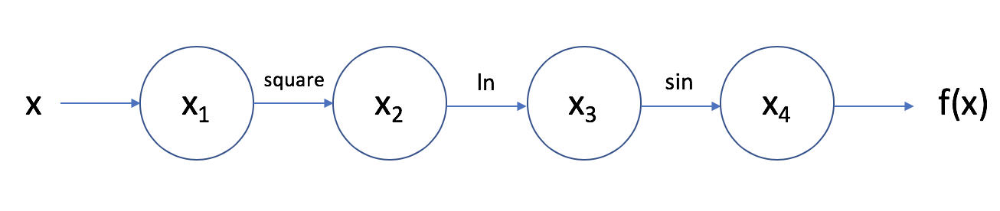
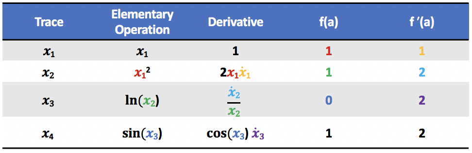

# `pyad`: CS207 Final Project Milestone 2


## Introduction

Derivatives and derivative arrays (Jacobians, Hessians, etc.) are ubiquitous in science and engineering. Example applications of derivatives include:

- __Data science:__ optimizing the parameters of a predictive model
- __Electrical engineering:__ simulating circuits with semiconductor elements
- __Climatology:__ modeling changes in atmospheric conditions while assimilating data from sensors around the world
- __Finance:__ calculating the price of financial instruments

In these cases (and many others involving simulation or optimization), it's necessary to compute derivatives and preferably not by hand.

So, how can derivatives be implemented in computer software?

One way is to create a numerical approximation (typically  using finite difference methods), however, this approach is prone to truncation error and is accurate only to a limited number of significant digits.

Another way is to use a computer algebra system to symbolically compute the derivative, however, this has a high computational cost.

The method of __Automatic Differentiation__ solves both these issues!

It is able to compute derivatives to machine precision in a fast, efficient way.


## Background

To see how automatic differentiation works, consider the following simple example:


Recall the chain rule, which states that if we have a function h(u(t)),  then


We can differentiate f(x) symbolically using the chain rule:


and evaluate the function and its derivative at, for example, a=1:


The first derivative is rather ugly, and it will keep getting uglier if we take higher order derivatives. Consider the following similar but slighly modified approach:

We can represent f(x) as a graph consisting of a series of computations:



The function is broken down into a sequence of __elementary operations.__ The value of $x_i$ at each step in the sequence is referred to as the __evaluation trace__.

We can create a table of the trace and its derivative at each step in the computation. We "seed" the derivative with a value of 1 and then proceed in steps:



This is conceptually the same thing that we did above when we differentiated symbolically using the chain rule and we find the same solution ___but___ notice that all we need to compute the the values of f(a) and f'(a) for each trace are the values in the row above (represented by corresponding colors in the table), and the differentiation rules for some simple elementary functions. There's no need to represent or store all those intermediate algebraic expressions symbolically. This is the beauty of automatic differentiation!

Although this example is very simple for illustrative purposes, the same idea can be generalized to multivariate and vector-valued functions. The matrix of first-order partial derivatives of a vector-valued function is referred to as the __Jacobian matrix__ of the functon, J<sub>f</sub>(_x_). Rather than creating a direct mapping between an input vector _x_ and full the Jacobian of a given function J<sub>f</sub>(_x_), automatic differentiation evaluates the action of the Jacobian on a vector _u_, computing the __Jacobian-vector product__ J<i>u</i>. When we represent our function of interest, f,  as a composite of N elementary functions, f = f<sub>N</sub>◦f<sub>N-1</sub>...◦f<sub>2</sub>◦f<sub>1</sub>, we can represent the Jacobian as J = J<sub>N</sub>·J<sub>N-1</sub>...·J<sub>2</sub>·J<sub>1</sub> due to the chain rule. We seed _u_ as a unit vector and then recursively compute matrix-vector products:

<p align="center"><i>u</i><sub>1</sub> = J<sub>1</sub><i>u</i></p align="center">
<p align="center"><i>u</i><sub>n</sub> = J<sub>n</sub><i>u</i><sub>n-1</sub> </p align="center">

The unit vector chosen for _u_ detemines which variable we are deriving with respect to. Consequently, we are able to compute only the partial derivatives we need rather than computing the full Jacobian.

This method of automatic differentiation (which is referred to as __forward mode__), can be very efficiently implemented as the previous evaluation trace can be overwritten at each step in the computation. We do not need to store the full sequence of evaluation traces. This is not true of other methods of automatic differentiation, such as reverse mode.

## How to use `pyad`

### Set up

**pyad** will be self contained on Github and should be installable using pip and the github ssh address.
```bash
pip install git+git://github.com/fire-breathing-rubber-lemons/cs207-FinalProject
```

**pyad** will follow the standard Python packaging framework. To use **pyad** it will first need to be imported using.
```python
import pyad
```

### Interaction Theory

In general the **pyad** package will work on an object oriented, class based approach similar to numpy and pytorch. **pyad** will contain a number of classes which can be instantiated. These classes include `pyad.Tensor` which is our primary wrapper around numbers and their derivatives, and `pyad.Variable` which inherits `pyad.Tensor` and represents a variable that should be differentiated against. The user will create functions to be differentiated and initialize variables. There will not be a specific set of default inputs as each user may have a very different use case (differentiating a single variable or multi-variable function for instance).

The user should be able to specify any differentiable function in the standard format, either a defined python function or a lambda function:
```python
def test_function(x, y):
    cos_x = pyad.cos(x)
    sin_y = pyad.sin(y)
    output = cos_x * sin_y
    return output


lambda x, y: pyad.cos(x) * pyad.sin(y)
```

**pyad** should be able to deal with either of these cases and end up with the same result, hence allowing the user to build functions of arbitrary complexity and not worry about having to change the implementation method.

### Demo

```python
import pyad

x = pyad.Variable('x', 1)
y = pyad.Variable('y', 2)
z = pyad.Variable('z', 3)

>>> x**2 + 2*y + z
Tensor(8, D(z=1, x=2, y=2))

def test_fun(x, y, z):
	return pyad.exp(pyad.cos(x) + pyad.sin(y))**z

>>> result = test_fun(x,y,z)
>>> result.value
77.38548247505909
>>> result.d['x']
-195.35291444436658
>>> result.d['y']
-96.61117118001052
>>> result.d['z']
112.17797471022807
```


## Software Organization

#### Directory Structure
The directory structure of the `pyad` package will be as follows where `cs207-FinalProject` is the name of the Github repository which hosts the package:

```
cs207-FinalProject/
    pyad/
        __init__.py
        forward_autodiff.py
        utilities/
            __init__.py
            ... (potential non-essential tools and extensions)
        tests/
            ... (tests for the core `forward_autodiff.py` as well as the utilities)
    docs/
        - ... (documentation about how to use pyad)
```

#### Modules
We plan on having a module for the core `pyad` forward autodifferentiation package. We also will include a module for `tests/` as well a a potential module for `utiltiies/` such as the neural network library described below.

#### Testing
Our test suite will be located in the `tests/` directory of the package. To run our tests, we are planning to use both `TravisCI` as well as `CodeCov`.

#### Distribution
The package will be distributed via Github and installed with pip by running:
```bash
pip install git+git://github.com/fire-breathing-rubber-lemons/cs207-FinalProject
```

#### Packaging
We use [`setuptools`](https://packaging.python.org/tutorials/packaging-projects/) to package our software.

## Implementation details

### Current Implementation

#### Core Data Structures
- `MultivariateDerivative`: a class to hold derivative information.
- `Tensor`: a class that takes in variable values, and compute and store the derivatives.
- `Variable`: a sub-class of `Tensor` that assigns variable values and initializes their derivatives to be 1.

#### Important attributes
If `t` is `pyad.Tensor` object, then the user can access some import attributes of `t`:
- `t.value` represents the actual numeric value of the object. `t.value` is a numpy object
- `t.d` represents the `pyad.MultivariateDerivative` associated with the tensor.
    - `t.d['x']` represents the derivative of `t` w.r.t. a variable named `'x'`

#### External dependencies
We use `numpy` as the underlying storage backing our `pyad.Tensor` objects. We also use numpy to perform efficient mathematical computations.

#### Elementary functions
Add, Subtract, Multiply, Power, Trig functions, Inverse trig functions, Exponential function, Log function, Square root function, Cubic root function.

#### To be implemented
- Variables with vector/matrix format
- Matrix operators, such as dot product
- Modify the current implementation to support vector functions of vectors and scalar functions of vectors
- Maybe: A visualization tool to show the workflow


## Future Features

Looking at applications of automatic differentiation, the one which stands out most prominently is back propagation for Neural Networks, having also been covered within the Harvard course, Introduction to Data Science.


Reference: AC209 - Introduction to Data Science, Harvard

Back propagation is used in machine learning to efficiently calculate the weights within a Neural Network. It utilzes a form of gradient descent to update the weights based on the derivative of the Loss function.

This is where automatic differentiation comes into play (specifically the reverse mode). Evaluating the neural network at some random starting point will produce a first calculation of Loss as a numeric value. What is then required is to work backwards from the output layer, calculating the derivative of the Loss function with respect to each neuron in the node and then update the weight based on this numeric value of the derivative and the learning rate specified.

For a given weight within the node the update process is:


For our future feature we'd like to implement the reverse mode of automatic differentiation, in order to make it a seamless process to generate a trained neural network from a given loss function.

#### Backward Mode

The reason for implementing the reverse mode of automatic differentiation is that it is much more efficient for when the number of features (variables to differentiate with respect too) exceeds the number of elementary functions. In the case of a neural network there will commonly be tens if not hundreds of nodes each of which have interconnecting weights creating hundreds if not thousands of weights which needs to be updated. Neural networks therefore present the perfect scenario to implement and test the reverse mode of automatic differentiation through back propagation.


#### Implementation

The current software implementation is designed to allow for expansion to other forms of automatic differentiation. The existing forward mode implementation is contained within the forward_mode.py file which has the Variable, Tensor and Multivariate Derivative classes required to set up and execute the forward mode. To implement the reverse mode we will add in a second file - reverse_mode.py which will include the required functions.

The reverse mode however will require a slightly different method of implementation:

1. Forward pass of reverse mode - evaluates the function values and partial derivatives at each node.
2. Backward pass - calculate the chain rule backwards from the output.

This will require us to modify the way values and derivaties are stored within the Variable and Tensor classes as there is now a requirement to store information throughout the tree during the forward pass and utilize this on the backward pass.

Where possible we can reuse or edit classes from the forward mode implementation - possibly combining into a single automatic_differentiation.py and then having subclasses of the Variable or Tensor objects for forward and reverse mode which would store different value and allow for the implementation of both modes within the pyad package.
